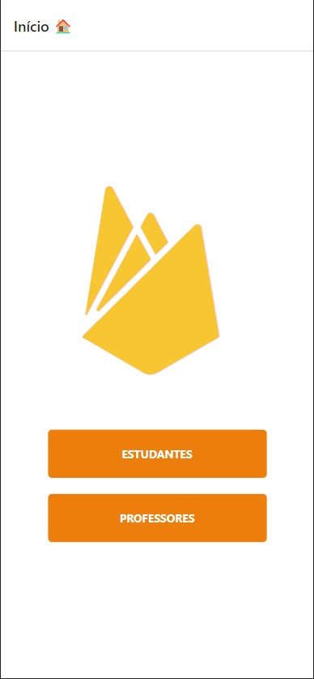
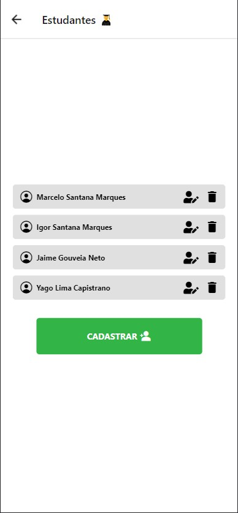
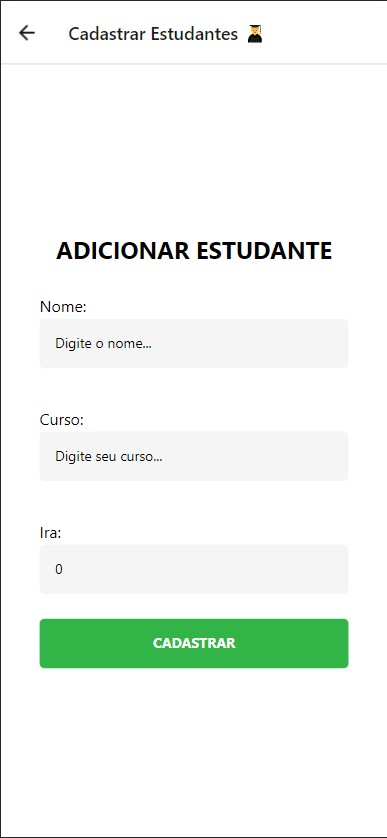
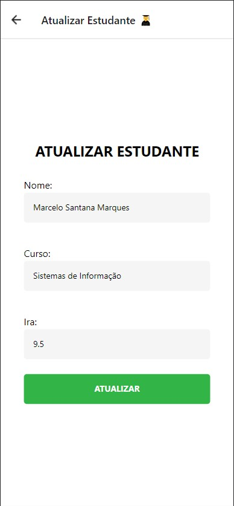
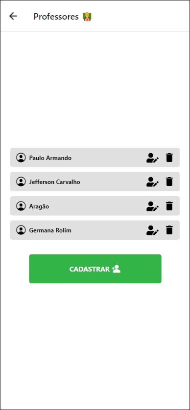
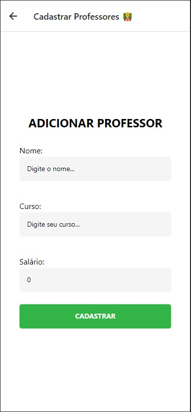
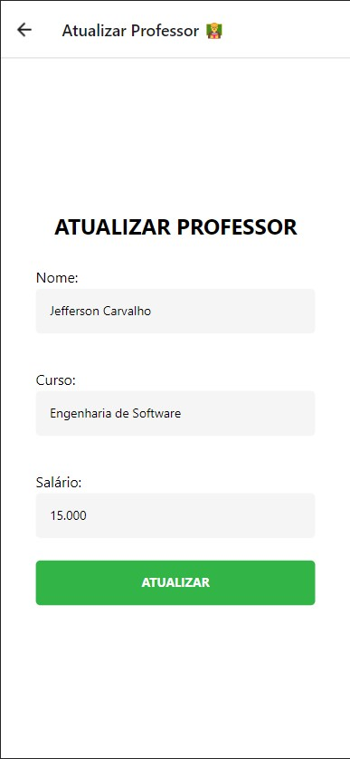
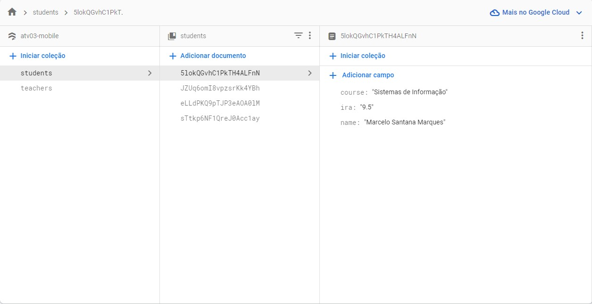
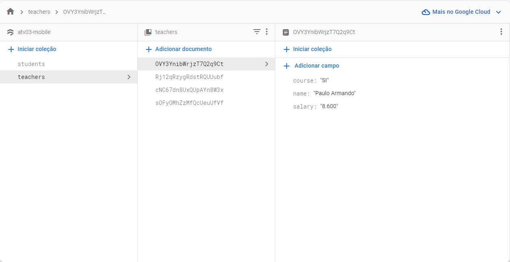

# TELAS - Aplicação FireBase 🦸

### Início

### Estudantes

Listagem            |  Cadastro           | Atualização
:-------------------------:|:-------------------------:|:-------------------------:
  |    | 

### Professores

Listagem            |  Cadastro           | Atualização
:-------------------------:|:-------------------------:|:-------------------------:
  |    | 

### Firebase

Tabela Estudantes           |  Tabela Professores
:-------------------------:|:-------------------------:
  |   